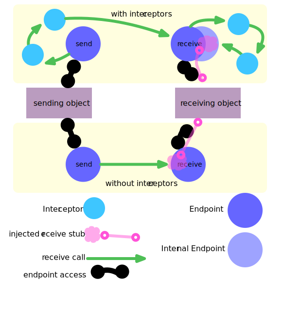
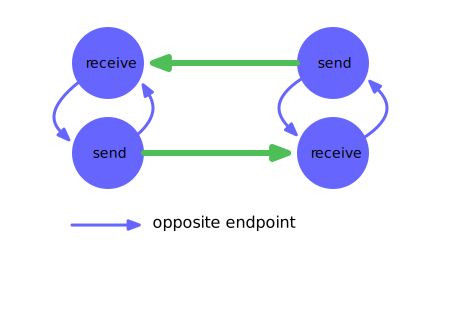
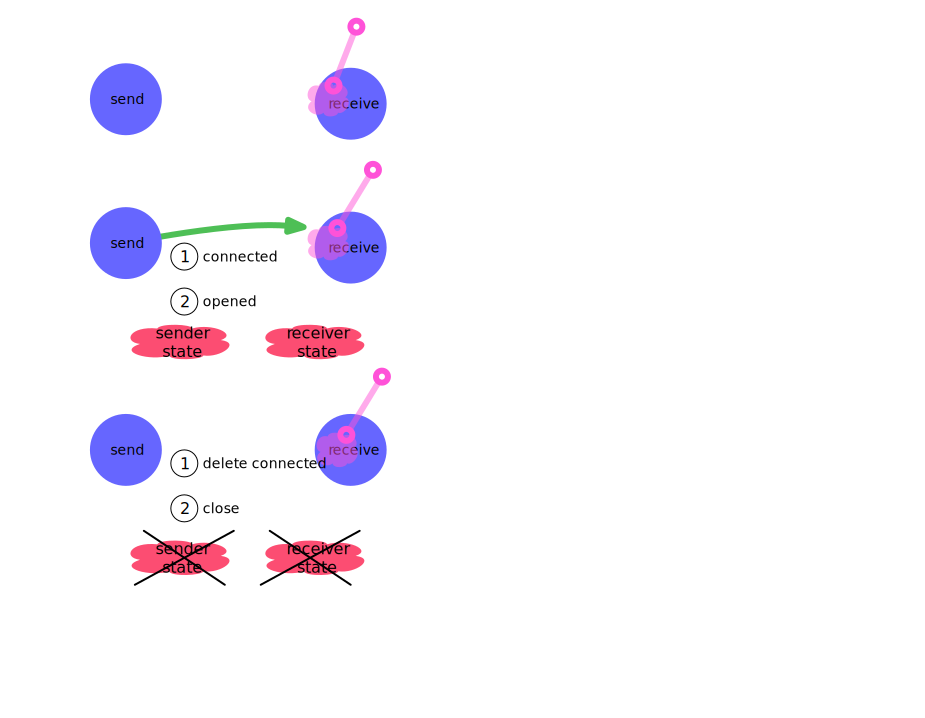

index
=====

kronos-endpoint

Named end of a communication channel.
There are always two ends A sending and a receiving endpoint always belong together.

opposite endpoints
===
to represent the opposite data flow the notion of opposite endpoints
is present.
Optionally each endpoint has an opposite one

connection states
===
when a working connection is established (isOpen)
the result of hasBeenOpenend is preserved
ans will be passed to willBeClosed(state)

